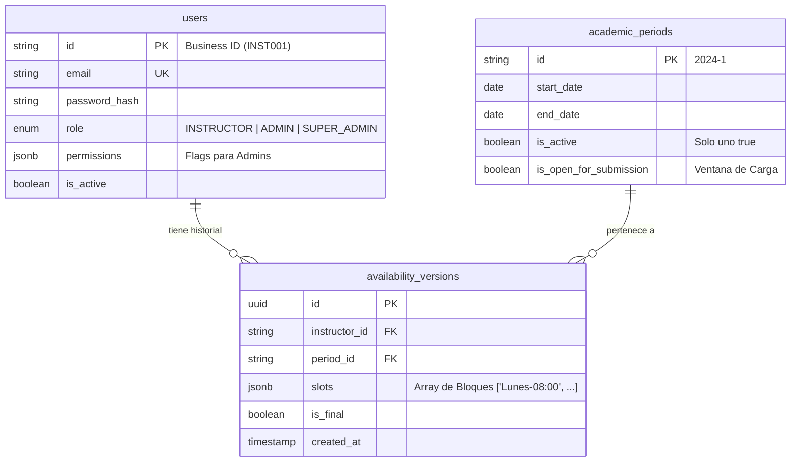

# Modelo Técnico de Datos (Database Schema)
**Motor:** PostgreSQL
**Estrategia:** Relacional Híbrida (Relaciones SQL estrictas + JSONB para estructuras variables).

Este documento define el esquema de base de datos necesario para soportar el sistema de gestión de disponibilidad con RBAC.

---

## 1. Diagrama Entidad-Relación (Conceptual)

---

## 2. Definición Detallada de Tablas

### A. Tabla: `users`
Centraliza a todos los actores del sistema. La diferenciación se hace por columna `role`.

| Campo | Tipo SQL | Restricciones / Default | Descripción |
| :--- | :--- | :--- | :--- |
| **`id`** | `VARCHAR(50)` | **PK**, Not Null | ID de Negocio (ej. "INST-001", "ADM-Juan"). No autoincremental. |
| `email` | `VARCHAR(255)` | **Unique**, Not Null | Correo para notificaciones y unicidad. |
| `name` | `VARCHAR(150)` | Not Null | Nombre completo para reportes. |
| `password_hash` | `VARCHAR(255)` | Not Null | Hash seguro (Argon2/Bcrypt). Nunca texto plano. |
| `dni` | `VARCHAR(20)` | Nullable | Documento de identidad. Usado para **Recuperación de Contraseña**. |
| `role` | `ENUM` | Not Null | Valores: `'INSTRUCTOR'`, `'ADMIN'`, `'SUPER_ADMIN'`. |
| `permissions` | `JSONB` | Default `'{}'` | Objeto para Admins: `{"canManageConfig": true, "canViewDash": true}`. |
| `is_active` | `BOOLEAN` | Default `true` | Soft Delete. Si es false, el login se bloquea. |
| `created_at` | `TIMESTAMPTZ` | Default `NOW()` | Auditoría de creación. |
| `updated_at` | `TIMESTAMPTZ` | Default `NOW()` | Auditoría de modificación. |

*   **Índices Recomendados:**
    *   `idx_users_email`: Búsqueda rápida por email.
    *   `idx_users_role`: Filtrado rápido de listas de instructores (Dashboard).

### B. Tabla: `academic_periods`
Define el contexto temporal.

| Campo | Tipo SQL | Restricciones / Default | Descripción |
| :--- | :--- | :--- | :--- |
| **`id`** | `VARCHAR(20)` | **PK**, Not Null | Identificador humano (ej. "2024-1", "2024-VERANO"). |
| `name` | `VARCHAR(100)` | Not Null | Nombre descriptivo (ej. "Ciclo Regular 2024-1"). |
| `start_date` | `DATE` | Not Null | Inicio oficial del ciclo. |
| `end_date` | `DATE` | Not Null | Fin oficial del ciclo. |
| `is_active` | `BOOLEAN` | Default `false` | Indica si es el periodo visualizado por defecto. |
| `is_open_for_submission`| `BOOLEAN` | Default `false` | **Ventana de Carga**. Controla si se permiten `POST` en availabilities. |

*   **Índices Recomendados:**
    *   `idx_periods_active`: Índice parcial `WHERE is_active = true` (Garantiza acceso O(1) al periodo actual).

### C. Tabla: `availability_versions`
Tabla transaccional central (Append-only). No se actualizan registros, se insertan nuevos.

| Campo | Tipo SQL | Restricciones / Default | Descripción |
| :--- | :--- | :--- | :--- |
| **`id`** | `UUID` | **PK**, Default `gen_random_uuid()`| Identificador único de la versión. |
| `instructor_id` | `VARCHAR(50)` | **FK** (`users.id`), Not Null | Referencia al docente. `ON DELETE RESTRICT`. |
| `period_id` | `VARCHAR(20)` | **FK** (`academic_periods.id`), Not Null | Contexto de la disponibilidad. |
| `slots` | `JSONB` | Not Null | Array de Strings: `["Lunes-07:30", "Lunes-08:00", ...]`. |
| `comments` | `TEXT` | Nullable | Observaciones del docente. |
| `is_final` | `BOOLEAN` | Default `false` | Indica si esta versión es la oficial para reporte. |
| `created_at` | `TIMESTAMPTZ` | Default `NOW()` | Timestamp exacto de la carga. Ordena el historial. |

*   **Índices Recomendados:**
    *   `idx_avail_instructor_period`: `(instructor_id, period_id)`. Para cargar el historial de un usuario.
    *   `idx_avail_final_reporting`: `(period_id, is_final)`. Para generar el reporte consolidado masivo rápidamente.

---

## 3. Relaciones y Cardinalidad

1.  **Instructor (1) -> Versiones (N):**
    *   Un usuario tiene muchas versiones de disponibilidad en el tiempo.
    *   Un usuario puede tener versiones en múltiples periodos académicos.

2.  **Periodo (1) -> Versiones (N):**
    *   Una versión pertenece estrictamente a un solo periodo.

3.  **Roles y Permisos:**
    *   No hay tabla separada de Roles. Se maneja como atributo en `users`.
    *   No hay tabla separada de Permisos. Se maneja como documento embebido (`JSONB`) en `users`. Esto simplifica las consultas (no hay JOINs extra en cada request para verificar permisos) y da flexibilidad para agregar nuevos flags sin alterar el esquema (Schema Migration).

---

## 4. Consideraciones Técnicas y Optimización

### A. Consultas Frecuentes
1.  **Obtener "Versión Final" (Reportes):**
    *   *Query:* `SELECT * FROM availability_versions WHERE instructor_id = ? AND period_id = ? AND is_final = true`.
    *   *Optimización:* El índice `idx_avail_final_reporting` cubre esta consulta perfectamente.
2.  **Historial Cronológico:**
    *   *Query:* `SELECT * FROM ... ORDER BY created_at DESC`.
    *   *Optimización:* PostgreSQL indexa automáticamente los timestamps, permitiendo paginación eficiente.

### B. Integridad de Datos (Constraints)

1.  **Eliminación de Instructores:**
    *   Configuración FK: `ON DELETE RESTRICT`.
    *   *Comportamiento:* Si se intenta borrar un usuario que ya tiene versiones cargadas, la base de datos lanzará error. Esto protege la integridad histórica.
    *   *Solución:* Usar Soft Delete (`is_active = false`) en lugar de `DELETE`.

2.  **Unicidad del Periodo Activo:**
    *   Solo debería haber un periodo con `is_active = true`.
    *   *Implementación:* Índice único parcial: `CREATE UNIQUE INDEX unique_active_period ON academic_periods (is_active) WHERE is_active = true;`. Esto impide a nivel de base de datos que existan dos periodos activos simultáneamente.

3.  **Gestión de `is_final`:**
    *   El sistema de aplicación (Backend Service) es responsable de asegurar que, al marcar una versión como final, se ejecute una transacción que ponga en `false` cualquier otra versión final previa para ese mismo usuario y periodo.

### C. Uso de JSONB para `slots`
*   **Justificación:** Guardar 7 días x 30 bloques = 210 filas por versión por usuario sería ineficiente (millones de filas rápidamente).
*   **Ventaja:** `JSONB` permite guardar el array `["Lunes-07:30", ...]` en una sola celda.
*   **Capacidad de Consulta:** PostgreSQL permite consultar dentro del JSONB si fuera necesario (ej. "¿Qué instructores están libres el Lunes a las 08:00?").
    *   Query: `SELECT instructor_id FROM availability_versions WHERE slots ? 'Lunes-08:00'`.

### D. Seguridad de Contraseñas
*   El campo `password_hash` debe ser lo suficientemente largo (255 chars) para soportar algoritmos robustos como **Argon2id**, que generan hashes largos con salt y parámetros de memoria incluidos.
